## 📍 정렬 (Sort)

**정렬 알고리즘** : 데이터를 특정한 기준에 따라서 순서대로 나열하는 것.

⚡ 정렬 알고리즘이 중요한 이유

- 프로그램 작성 시 가장 많이 사용됨.
- 이진 탐색의 전처리 과정
- 정렬을 공부하다보면 '알고리즘의 효율성'을 쉽게 이해할 수 있음.
- 상황에 따라 적절한 정렬 알고리즘을 사용할 수 있어야 함.

## 💡 선택 정렬 (Selection Sort)

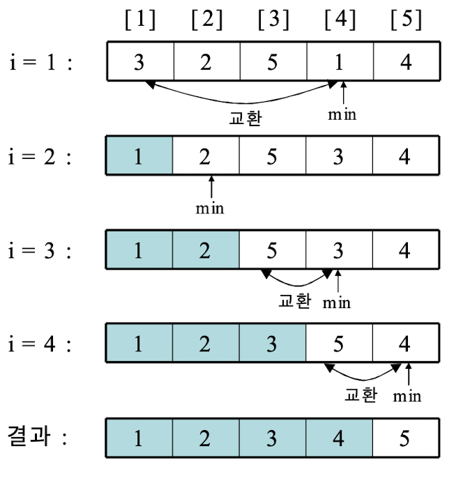

### 🔸 특징

- 가장 작은 데이터를 선택해서 맨 앞 데이터와 교환하는 방식
- 구현이 단순하지만 비효율적임
- 데이터 수가 적을 때 적합

### 🔸 시간 복잡도

- 최선: O(N²)
- 평균: O(N²)
- 최악: O(N²)

### 🔸 코드 예시 (Python)

```python
def selection_sort(array):
    for i in range(len(array)):
        min_idx = i
        for j in range(i+1, len(array)):
            if array[j] < array[min_idx]:
                min_idx = j
        array[i], array[min_idx] = array[min_idx], array[i]
```

## 💡 삽입 정렬 (Insertion Sort)

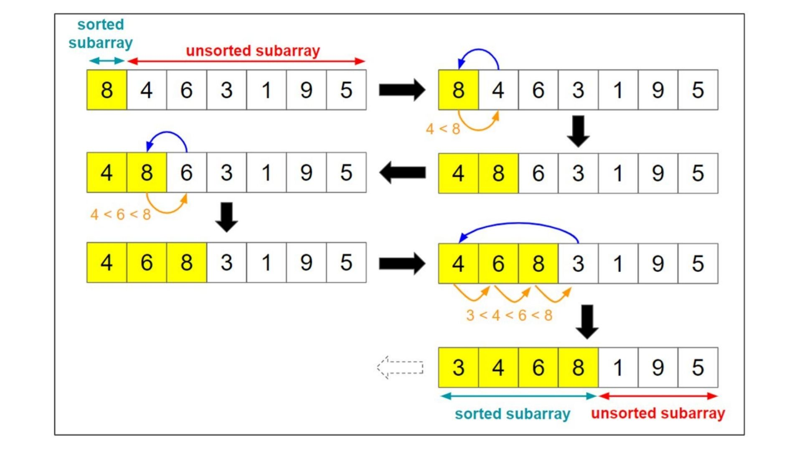

### 🔸 특징

- 앞에서부터 차례로 삽입 위치를 찾아 정렬
- 이미 정렬된 데이터에 강함
- 실무에서도 자주 사용되는 정렬 방식

### 🔸 시간 복잡도

- 최선: O(N)
- 평균: O(N²)
- 최악: O(N²)

### 🔸 코드 예시 (Python)

```python
def insertion_sort(array):
    for i in range(1, len(array)):
        key = array[i]
        j = i - 1
        while j >= 0 and array[j] > key:
            array[j + 1] = array[j]
            j -= 1
        array[j + 1] = key
```

## 💡 버블 정렬 (Bubble Sort)

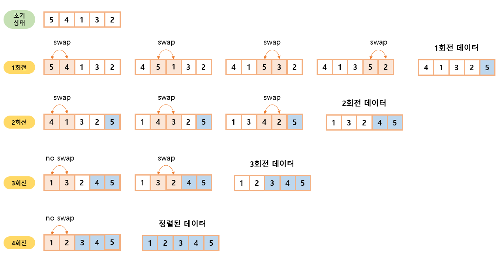

### 🔸 특징

- 인접한 두 값을 비교하고 교환하면서 큰 값을 뒤로 보내는 방식
- 매우 비효율적이지만 개념적으로 이해하기 쉬움

### 🔸 시간 복잡도

- 최선: O(N)
- 평균: O(N²)
- 최악: O(N²)

### 🔸 코드 예시 (Python)

```python
def bubble_sort(array):
    for i in range(len(array)):
        for j in range(0, len(array)-i-1):
            if array[j] > array[j+1]:
                array[j], array[j+1] = array[j+1], array[j]
```

## 💡 계수 정렬 (Counting Sort)

### 🔸 특징

- 정수 데이터에 한해 사용 가능
- 데이터의 범위가 한정적일 때 매우 빠름
- 비교 연산이 아예 없음
- 음수 데이터를 다루지 못함 (보정 필요)

### 🔸 시간 복잡도

- O(N + K) (N: 데이터 수, K: 데이터 중 최대값)

### 🔸 코드 예시 (Python)

```python
def counting_sort(array):
    max_val = max(array)
    count = [0] * (max_val + 1)
    for num in array:
        count[num] += 1
    result = []
    for i in range(len(count)):
        result.extend([i] * count[i])
    return result
```

### 🔸 방법

#### 수열 A : 5, 5, 3, 4, 5, 1, 0, 4, 1, 3, 0, 2, 4, 2, 3, 0이 존재

1. 각 숫자가 몇 번 등장하는지 계산
   | 숫자 | 0 |1 |2 |3 |4 |5 |
   | 등장횟수 | 3 |2 |2 |3 |3 |3 |

2. 등장 횟수를 누적합으로 바꿔줌
   | 숫자 | 0 |1 |2 |3 |4 |5 |
   | 누적 합 | 3(3) | 5(3+2) |7(3+2+2) |10(3+2+2+3) |13(3+2+2+3+3) |16(3+2+2+3+3+3) |

> 누적합으로 바꾸는 이유: 0, 2, 0, 100, 2, 0 같은 수열을 정렬하는 상황을 가정하면, 중간에 등장한 뜬금없는 100 같은 숫자 때문에 3~99까지 무의미한 순회를 해야 함. => 숫자 크기에 시간복잡도가 매우 큰 영향을 받아서 비효율적!

- 누적합에서 할 수 있는 점 : 숫자 0은 1~3 인덱스에 ㅟ치, 숫자 2는 4~7 인덱스에 위치

- 2번 과정에서 구한 누적합은 **배열A의 숫자**가 배열 B의 **어디에 위치해야 할 지** 정확히 알려줌.

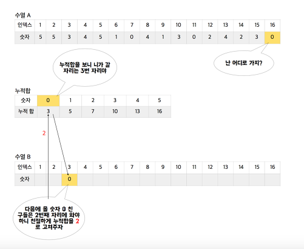
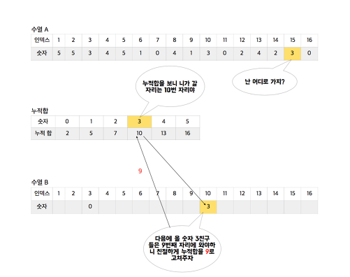
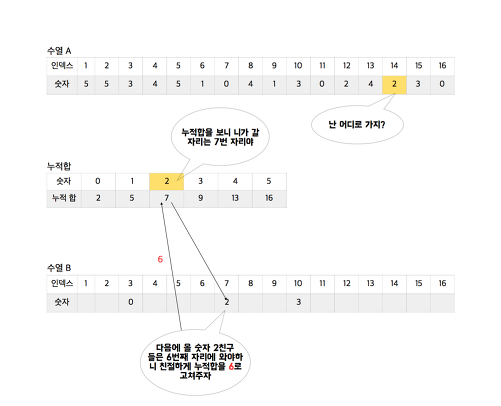
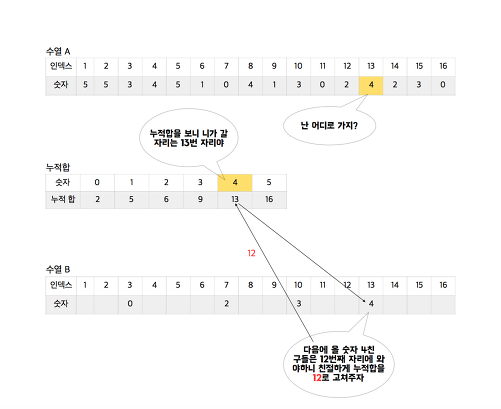
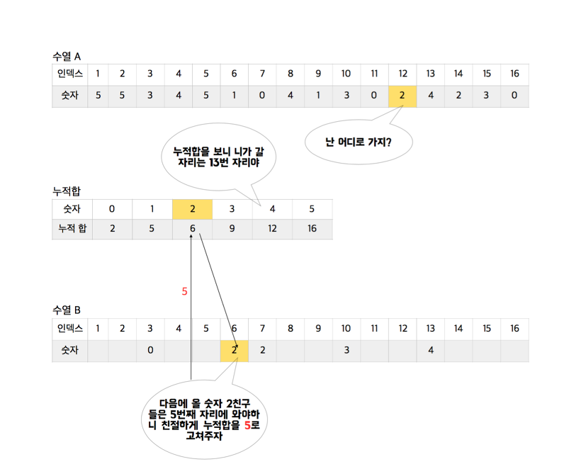

https://www.cs.miami.edu/home/burt/learning/Csc517.091/workbook/countingsort.html

### 🔸 정리

- Counting Sort의 시간 복잡도는 O(n)으로 Quick Sort보다 훨씬 유리해보이나, Counting Sort는 대부분의 상황에서 엄청난 **메모리 낭비**를 유발함.

- 누적합 배열에 대한 접근을 O(1)으로 달성하기 위해 정렬할 배열에 포함된 숫자의 최댓값 만큼의 메모리를 필요로하기 때문에,

- 0, 20, 0, 100, 2, 0 배열 : Counting Sort 알고리즘이 적합하지 X
- 5, 5, 3, 4, 5, 1, 0, 4, 1, 3, 0, 2, 0 : 적합 (정렬하는 숫자가 *특정한 범위*에 있을 떄 사용)

- 26개의 알파벳으로 이루어진 문자열에서 Suffix Array를 얻는 경우 - 대표적으로 사용한다.

## 💡 병합 정렬 (Merge Sort)

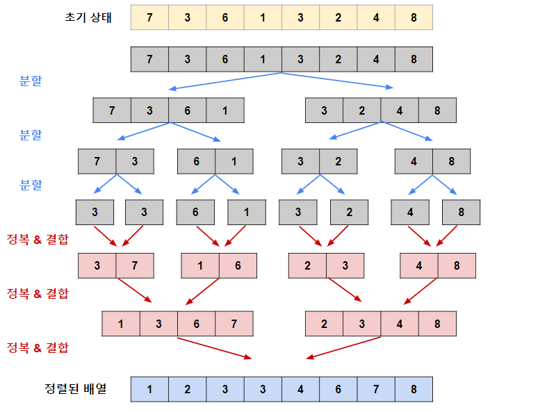

### 🔸 특징

- 분할 정복 알고리즘의 대표
- 배열을 반으로 쪼개고 병합하면서 정렬
- 안정 정렬이며 항상 O(N log N) 보장

### 🔸 시간 복잡도

- 최선: O(N log N)
- 평균: O(N log N)
- 최악: O(N log N)

## 💡 힙 정렬 (Heap Sort)

### 🔸 특징

- 힙(Heap)을 이용하여 최대/최소값을 하나씩 꺼내 정렬

### 🔸 자료구조 'Heap'

- 완전 이진 트리의 일종으로 우선순위 큐를 위하여 만들어진 자료구조
- 최댓값, 최솟값을 쉽게 추출할 수 있음

### 🔸 Heap Sort 개념 요약

- 최대 힙 트리나 최소 힙 트리를 구성해 정렬
- 내림차순 정렬을 위해서는 최대 힙을 구성하고 오름차순 정렬을 위해서는 최소 힙을 구성하면 됨.
- 과정

1. 정렬해야 할 n개의 요소들로 최대 힙(완전 이진 트리 형태)을 만든다.

- 내림차순 기준 정렬

2. 그 다음으로 한 번에 하나씩 요소를 힙에서 꺼내서 배열의 뒤부터 저장
3. 삭제되는 요소들은 값이 감소되는 순서로 정렬 (최댓값부터 삭제 )
   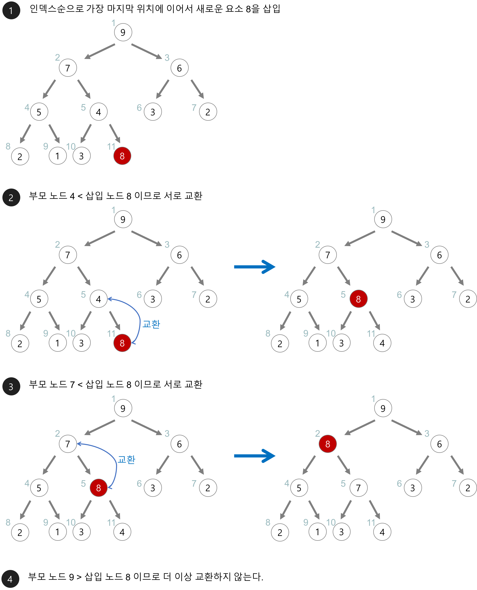
   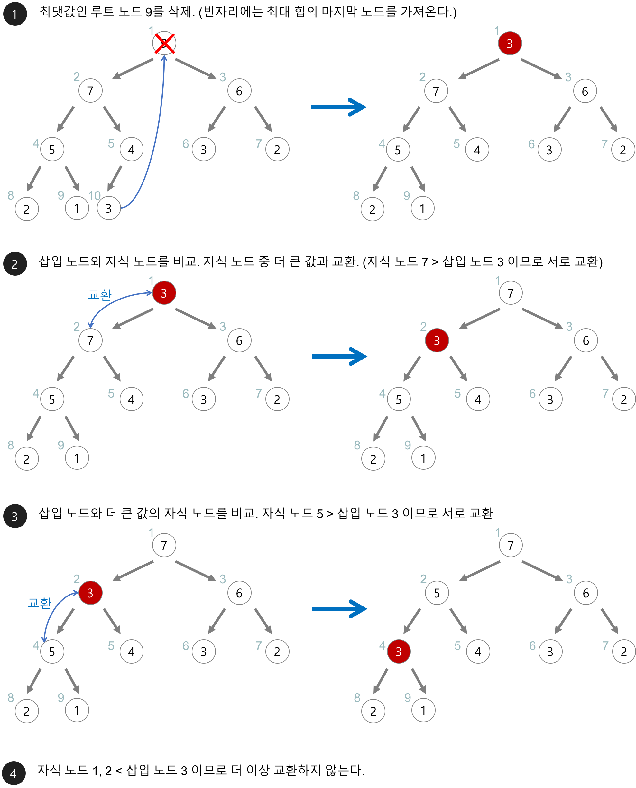

### 🔸 Heap Sort 특징

- 시간 복잡도가 좋음
- 전체 자료를 정렬하기보다, 가장 큰 몇개의 값을 꺼낼 때 사용하면 좋음.

### 🔸 시간 복잡도

- 최선: O(N log N)
- 평균: O(N log N)
- 최악: O(N log N)

### 🔸 코드 예시 (Python)

```python
import heapq

def heap_sort(array):
    heap = []
    for value in array:
        heapq.heappush(heap, value)
    result = []
    while heap:
        result.append(heapq.heappop(heap))
    return result
```
